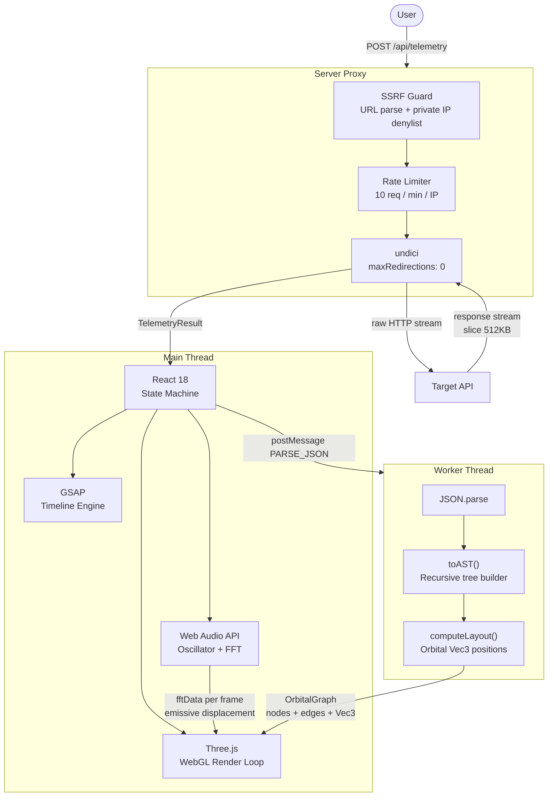

# astonal

A network profiler that turns JSON into orbital geometry and HTTP status codes into synthesized sound.

Point it at any public API. The response body gets parsed into an Abstract Syntax Tree. That tree gets laid out as a three-dimensional orbital node graph in real-time WebGL. The HTTP status code gets expressed as a chord mode through the Web Audio API. Every request produces a unique audiovisual signature — different endpoints sound different, look different, every time.

No charting libraries. No audio frameworks. No UI component kits. Everything rendered from scratch in React, Three.js, GSAP, and the Web Audio API.

---

## stack

| layer | technology | purpose |
|---|---|---|
| ui framework | React 18 | state, refs, effect scheduling |
| 3d renderer | Three.js r169 | WebGL scene, geometry, materials, render loop |
| animation | GSAP 3 | entrance sequences, telemetry transitions, shimmer |
| audio | Web Audio API native | oscillator synthesis, FFT analysis, mesh feedback |
| compute | native Web Worker | JSON parsing, AST construction, orbital coordinate math |
| proxy dev | Vite middleware + undici | telemetry proxy, SSRF guard, rate limiter |
| proxy prod | Vercel Serverless + undici | same proxy, 15s max duration, edge-deployed |
| types | TypeScript 5.6 strict | discriminated union contracts, zero any |

---

## system architecture

The system is partitioned across three execution environments. The main thread owns rendering and audio. A dedicated Web Worker owns all heavy compute. The server proxy owns all outbound network access. None of these boundaries are suggestions — they are hard architectural constraints.



The proxy intercepts every outbound request before it leaves the server. SSRF validation runs first — private RFC 1918 subnets, loopback addresses, and cloud metadata endpoints are hard-rejected at the URL constructor level before undici is ever invoked. Rate limiting runs second. The response stream is read into a buffer and sliced to 512KB before the payload crosses back to the browser. None of this is optional at the API level.

The worker is stateless and pure. It receives a raw JSON string over `postMessage`, constructs an internal AST through a recursive `toAST()` pass (arrays capped to 12 children, keyCount normalized to sliced length, recursion halted at depth 2), runs the full orbital coordinate calculation entirely in plain arithmetic, and posts back a serializable `OrbitalGraph` containing pre-computed `Vec3` positions. Three.js on the main thread instantiates mesh geometry directly from those coordinates. Zero layout math happens on the main thread. The render loop stays clean.

The redirect policy is deliberate. `undici` is configured with `maxRedirections: 0`. A 3xx response halts the proxy immediately — the Location header is captured, timing is measured, and the redirect is returned as a first-class telemetry event rather than silently followed. You see the real network topology, not the resolved endpoint.

---

## system telemetry & generative audio

The telemetry layer measures three numbers that actually matter: time-to-first-byte, total response time, and HTTP status code. Those three numbers determine everything that happens next — the color scheme, the background tint, the audio profile, and whether the worker is invoked at all.

The audio engine is built entirely from native Web Audio API primitives. Oscillators, gain envelopes, waveshapers, and delay nodes, wired by hand. The synthesis profiles are not cosmetic. Each one maps directly to a psychological state.

| status class | synthesis profile | character |
|---|---|---|
| 2xx success | C-major pentatonic arpeggio, sine waves, 6-note ascending sequence, root shift and note spacing seeded from body length XOR latency | harmonic, clean, unique per endpoint |
| 3xx redirect | Lydian mode arpeggio, sine waves, augmented fourth interval, floating ascending contour | ethereal, unresolved |
| 401 / 403 | square wave carrier FM-modulated by a second square at 440Hz, staccato gating in three sharp bursts | immediate, metallic, denied |
| 404 / 408 / 0 | sine waves through a feedback delay line at 0.55s delay and 0.52 feedback gain, descending Dorian scale, 6 voices | spatial, empty, echoing |
| 5xx | sawtooth waves through a custom waveshaper distortion curve, 8-note diminished stack, all voices simultaneous | aggressive, broken |

Audio seeding is precise. The seed value is `(body.length XOR round(ttfb * 3.7)) & 0xFF`. The same endpoint hit twice in rapid succession produces slightly different sounds as latency drifts. Different endpoints returning the same status code sound different because body sizes diverge. The audio is a fingerprint of the response, not a generic status alert.

An `AnalyserNode` reads FFT data at 512 bins on every animation frame. Low-frequency bins 1–3 drive emissive intensity and scale on the root sphere. Mid-frequency bins 12–18 pulse depth-1 child nodes. High-frequency bins 35–50 animate the leaf geometry. The 3D graph breathes with the sound.

The spectrum visualizer is a 2D canvas element composited over the WebGL viewport. 64 gradient bars per frame, reading the same FFT buffer, color-matched to the current status class — green for 2xx, cobalt for 3xx, white for 4xx/5xx. It costs one canvas draw call per frame and shares the data the audio engine already computed.

---

## terminal design system & crt visuals

The visual language is synthwave on black. One background color. Five semantic accent colors. No decorative gradients, no illustration, no iconography. Every visual element either communicates state or gets removed.

| token | value | semantic role |
|---|---|---|
| background | #000000 | canvas, panels, header, footer |
| white | #ffffff | 4xx errors, interactive elements, primary text |
| cobalt | #5599ff | labels, 3xx redirects, fast timing, info states |
| green | #4cbb17 | 2xx success, AST geometry data, nominal timing |
| orange | #ff8c42 | 5xx server errors, deep orbital nodes |
| surface | #0d0d0d | input backgrounds, header wells |
| border | #141414 | dividers, panel separators |
| muted | #1e1e1e | secondary labels, audio footer text |

Two CRT texture layers run as fixed-position overlays at the top of the z-stack, above the WebGL canvas and all UI panels.

The grain overlay is an inline SVG data URL — a 300×300 `feTurbulence` noise filter with `baseFrequency=0.82` and four octaves, tiled at 256px, composited with `mix-blend-mode: overlay` at 4.5% opacity. It costs nothing at runtime because it is a CSS background-image declaration, not a canvas operation.

The scanline overlay is a `repeating-linear-gradient` producing 1px dark stripes every 3px across the full viewport height. No JavaScript. No canvas draw call. One CSS rule.

The background tint behind the WebGL canvas is a full-bleed `rgba` overlay that transitions on every response. Green for 2xx, cobalt for 3xx, white-tinted for 4xx, orange-tinted for 5xx. The `transition` property is set to `1.4s ease` — slow enough to read as a system state shift rather than a UI flash. The status code hero block inherits the same color and is the largest typographic element on the screen: Orbitron weight 900 at 56px. It lands before anything else.

Typography splits across two families. Orbitron handles all identifiers — the wordmark, status codes, phase labels, the analyze button, anything that should read as a terminal readout. JetBrains Mono handles all data values — URLs, header names, timing numbers, content types. System font stack covers structural UI text.

---

## physics-driven motion

GSAP runs four independent animation systems. They are isolated from each other and none of them interact with the Three.js render loop.

The entrance sequence fires once on mount via `gsap.context`. A single timeline staggers four elements in under a second: the header descends from `y: -18` with `autoAlpha` fade, the WebGL canvas scales up from `0.97` with `power2.out`, the right panel translates in from `x: 32`. The sequence is a system boot, not a page load.

The telemetry panel animates on every new response. The container drops in from `y: 12, scale: 0.97` with a `back.out(1.4)` ease. The status code block separately enters from `scale: 1.5, blur: 8px` using `back.out(2)`. The two animations are independent — the status number punches in harder than the surrounding panel. Data arriving under pressure.

The timing bars use a deferred width pattern. Each bar stores its target percentage as a `data-pct` attribute at render time. On telemetry arrival, GSAP reads the attribute and animates `width` from 0 to target over 0.88 seconds with staggered 0.09s delays between bars and `back.out(1.6)` easing. The bars spring rather than ease. The overshoot communicates precision.

The analyze button runs a continuous shimmer. A `gsap.timeline` with `repeat: -1` and `repeatDelay: 4` sweeps a semi-transparent gradient stripe from `-110%` to `+110%` across the button surface every few seconds. The primary action stays alive at all times without visual noise.

Every state transition has declared motion intent. The error panel enters from `x: 8, scale: 0.96`. The AST geometry stat rows stagger at 0.06s intervals with `x: -6` entry offsets. Nothing snaps. The UI communicates that the system is doing real work.

---

## on building this

The hardest problem was not the WebGL, not the audio synthesis, and not the worker thread boundary — it was a silent 4KB truncation in the proxy layer that cut response bodies mid-JSON and caused the worker to throw a `SyntaxError` with no visible upstream indication. The telemetry showed 200 OK, the timing looked normal, the headers arrived complete, and the orbital graph simply never appeared. Tracing that failure backward through the audio trigger, the worker timeout handler, the worker message contract, and finally to a `.slice(0, 4096)` call buried inside the undici body buffer taught us that every pipeline layer needs an explicit, documented size contract — not just the parser that consumes the data at the end. Raising both the Vite middleware and the Vercel function to 512KB and trusting the worker's own depth and child count limits as the correct complexity boundary fixed an entire class of silent failures at once. The future of astonal is authentication-aware profiling with header injection, a structural diff mode that overlays two orbital graphs simultaneously and renders divergence as geometric displacement, and a session recorder that captures a sequence of requests as an animated orbital timeline — the full story of how a system responds under real conditions, expressed entirely as geometry and sound.

---

## running locally

```bash
git clone https://github.com/brightyorcerf/astonal
cd astonal
npm install
npm run dev
```

The Vite dev server mounts the telemetry proxy as custom middleware. No separate backend process. Open `http://localhost:5173`.

For Vercel deployment, `api/telemetry.ts` is detected automatically as a serverless function. The `vercel.json` rewrite rule sends all non-API routes to `index.html`.

---

## compatible apis

Any public HTTPS endpoint that returns JSON and responds within 12 seconds. No authentication, no API keys.

```
https://pokeapi.co/api/v2/pokemon/ditto
https://restcountries.com/v3.1/name/japan
https://randomuser.me/api/
https://catfact.ninja/fact
https://wttr.in/London?format=j1
https://hp-api.onrender.com/api/characters
https://api.spacexdata.com/v4/launches/latest
https://www.dnd5eapi.co/api/spells/fireball
https://jsonplaceholder.typicode.com/users/1
https://images-api.nasa.gov/search?q=nebula&media_type=image
https://universities.hipolabs.com/search?country=India
```

HTTP endpoints are blocked at the client-side SSRF guard. Private IP ranges and cloud metadata endpoints are blocked at the server-side guard. Endpoints returning non-JSON bodies pass through telemetry normally — the orbital graph is skipped, the audio still fires.

---

`astonal v1.0 — telemetry via vercel edge network us-east`
